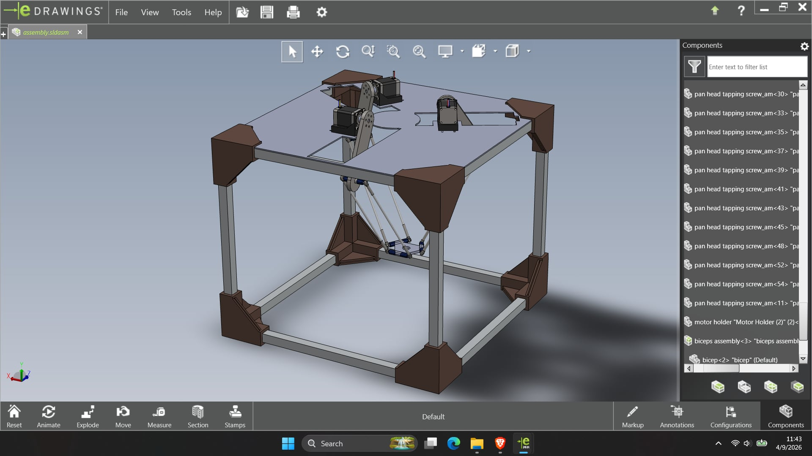
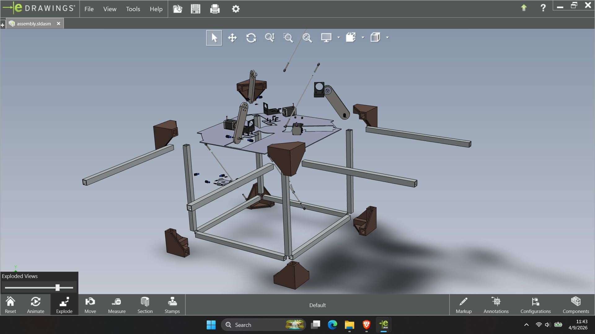
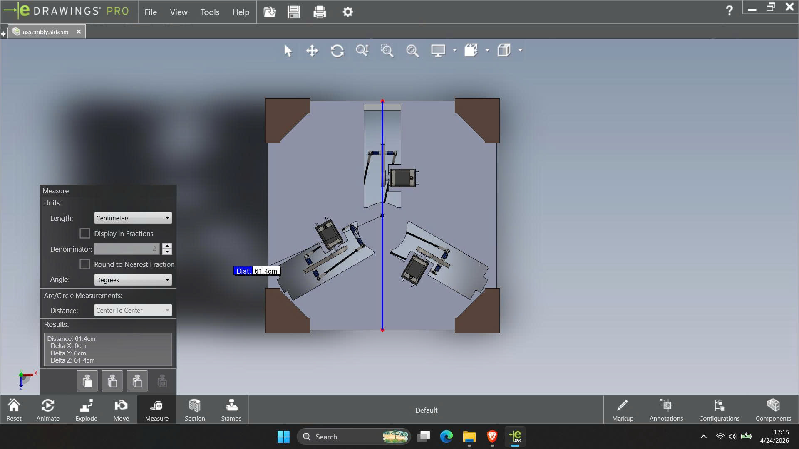
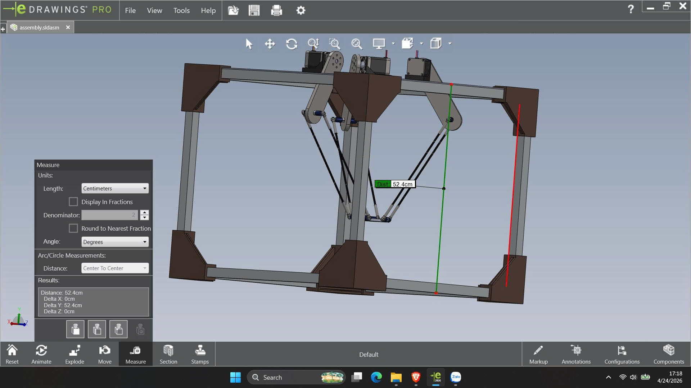

# Delta Robot Project (WIP)

A personal engineering project to design and build a 3-DOF Delta Robot, from CAD and 3D-printed parts to embedded control and motion testing.

## Current Status

- Project stage: **Work in Progress**
- Mechanical/CAD design is available
- Prototype integration and control are in progress
- Final calibration and production-ready behavior are not finished yet

## What Is Included Right Now

- CAD assembly snapshots
- STL files for 3D printing (`filein3d_STL`)
- Assembly file (`assembly.sldasm`)
- Initial embedded code (`napcode/code/code.ino`)
- Reference images used for documentation

## Project Gallery

### Complete Assembly View

Overall CAD assembly of the Delta Robot frame, motor mounts, and arm linkage.

### Exploded Assembly View

Exploded view showing how structural and moving components fit together.

### Top View Measurement

Top view with geometric spacing measurement used for frame and actuator placement checks.

### Side View Measurement

Side view with height/clearance measurement for workspace and vertical layout validation.

## Repository Highlights

- `image/`: screenshots, measurement views, and CAD references
- `image/filein3d_STL/`: printable STL component set
- `robotdelta/`: mirrored project assets (CAD + STL + images)
- `napcode/code/code.ino`: early firmware/control sketch

## Next Milestones

- Finish mechanical assembly validation
- Refine control firmware and motion sequencing
- Add kinematics and trajectory testing
- Tune repeatability and accuracy
- Publish final demo and full build guide

## Tools and Stack

- CAD / 3D design workflow
- 3D-printed mechanical parts (STL)
- Embedded control (Arduino/ESP-style `.ino` workflow)

## Note

This repository is actively updated while the robot is being developed.
